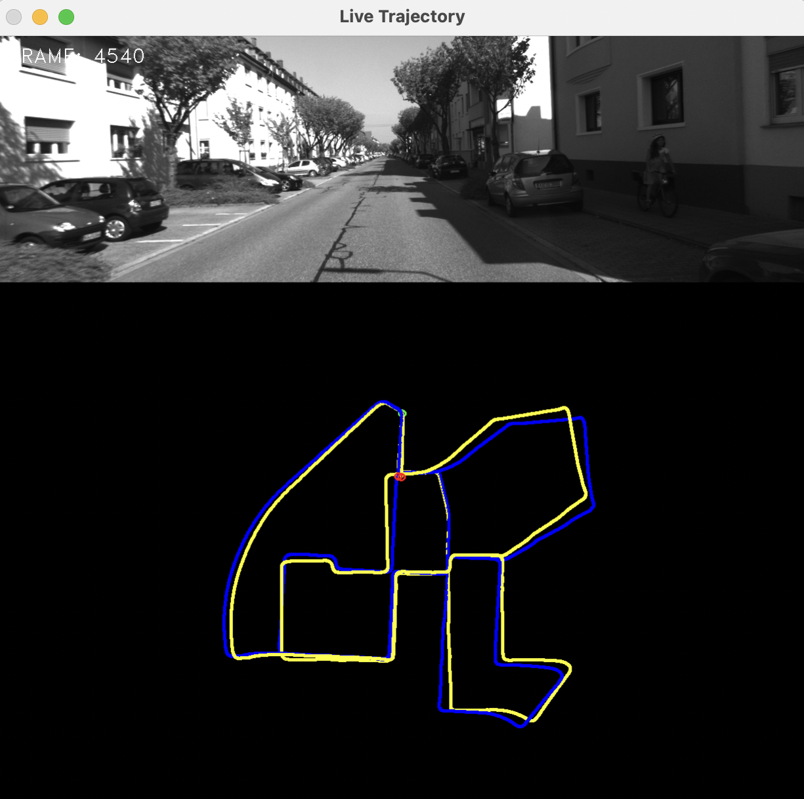

Monocular Visual Odometry run on

KITTI odometry dataset

http://www.cvlibs.net/datasets/kitti/eval_odometry.php

Reference
(1) Monocular Visual Odometry using OpenCV 

http://avisingh599.github.io/vision/monocular-vo/

